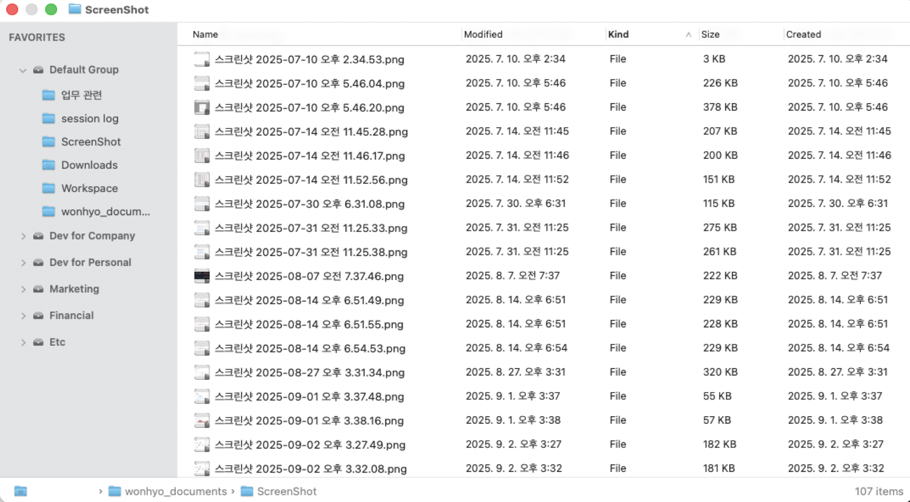
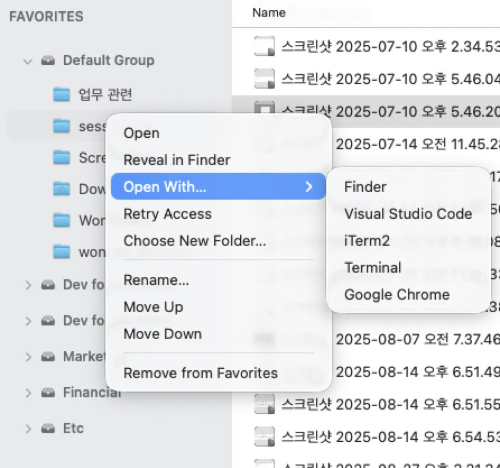
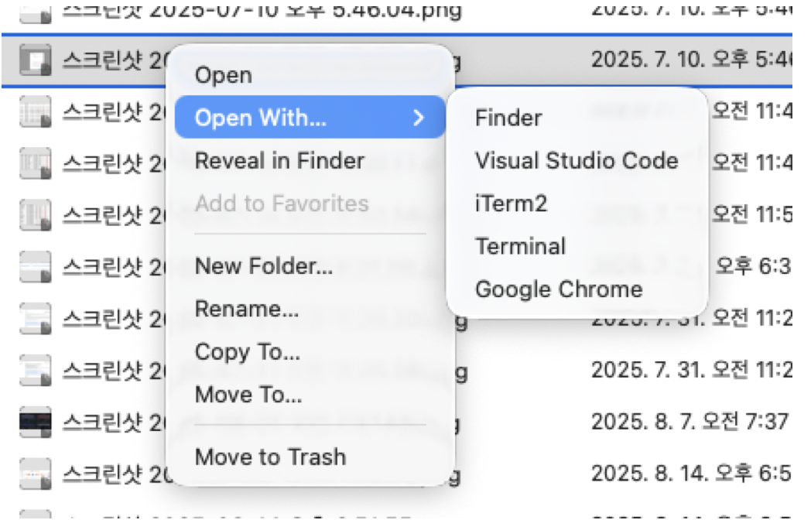
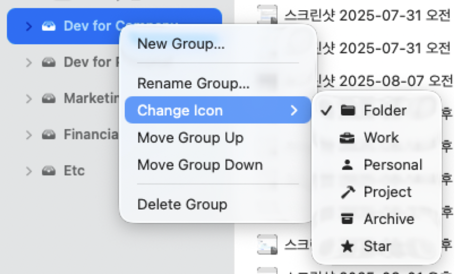
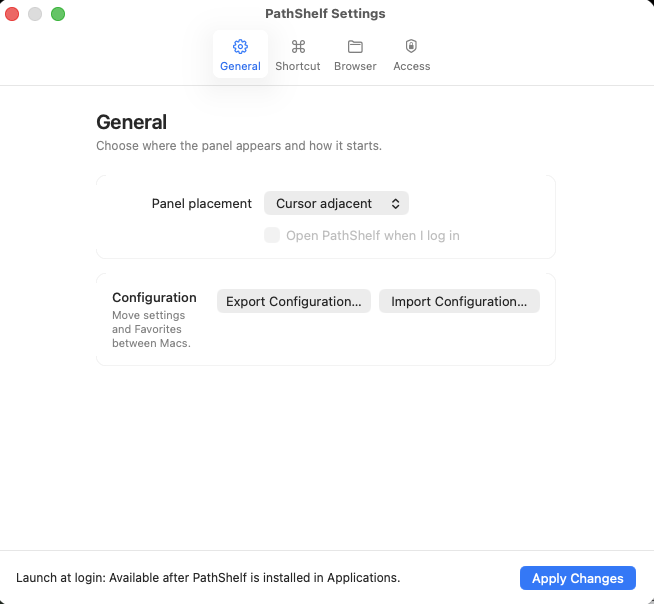
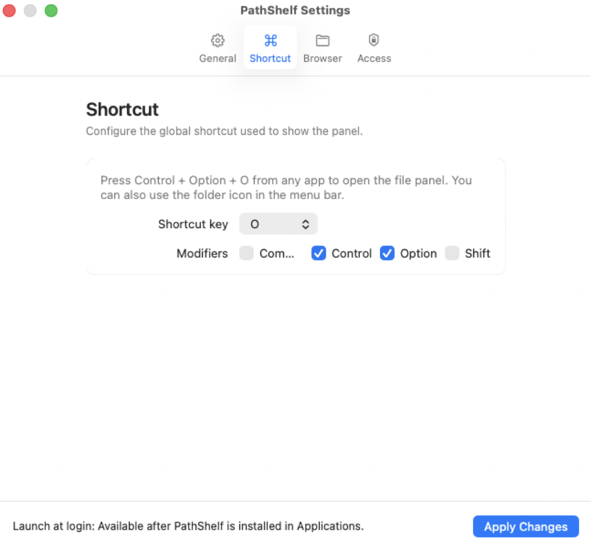
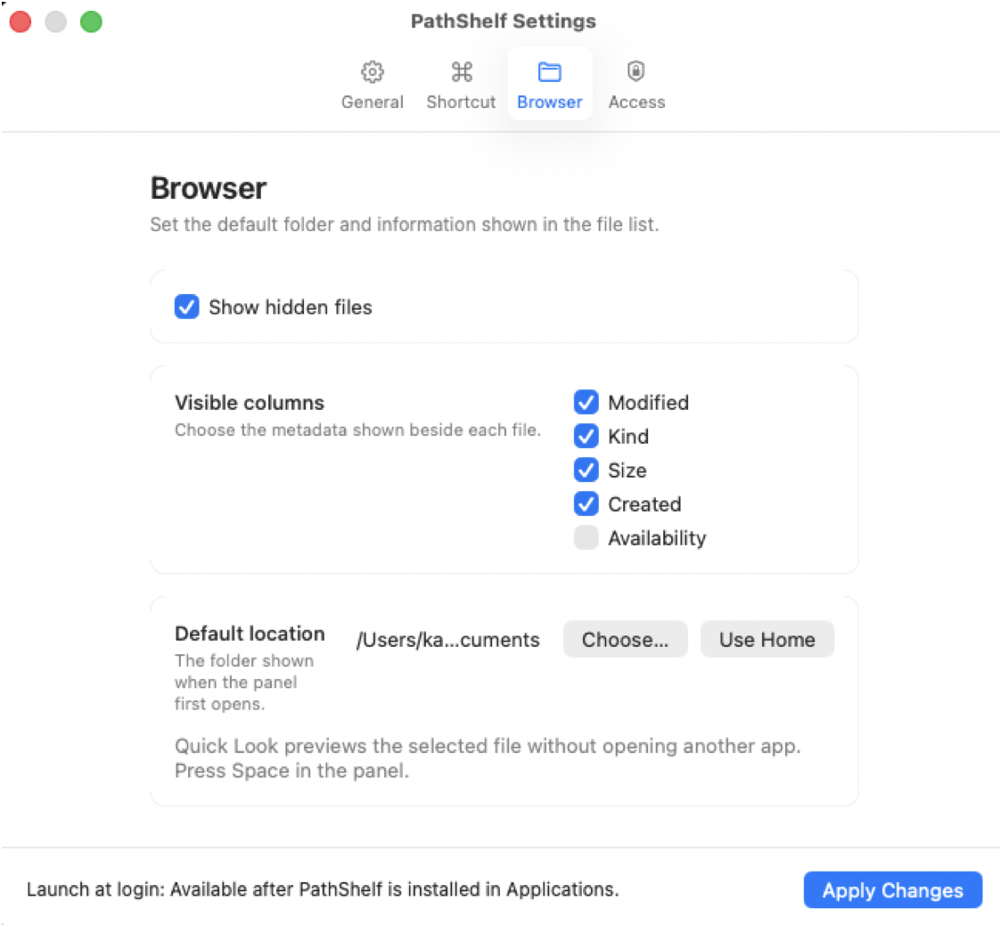

# PathShelf

PathShelf is an offline-first macOS 15+ Apple Silicon utility for fast access to saved folders from a lightweight floating panel.

The app is intentionally local-only: no telemetry, no accounts, no update checks, and no app-initiated network client. iCloud placeholder downloads and network shares remain OS/provider behavior, not app-owned traffic.

<p align="center">
  
</p>

## Project Status

PathShelf v0.2.0 is the current public **source-only checkpoint release**.
GitHub provides source archives, while users build and run the app locally.
No prebuilt, Developer ID-signed, or notarized app binary is included.

The project is designed as a reference-quality native utility: file operations
default to safe outcomes, hidden-panel work is explicitly torn down, and offline
claims are backed by source, binary, and runtime checks rather than telemetry.

## MVP Features

- Global shortcut through Carbon `RegisterEventHotKey`, without Accessibility, CGEventTap, or global event monitoring.
- Floating AppKit `NSPanel` with cursor-adjacent or active-display top-center placement.
- Resizable 1080×580 default panel with grouped Favorites, clickable Finder-style bottom path bar, and right-aligned item count.
- Clickable Name and optional detail headers for sorting the visible directory.
- Settings for hidden files, optional Modified/Kind/Size/Created/Availability columns, the default startup folder, persistent folder access, and Full Disk Access guidance.
- Double-click folder navigation plus native file and Favorite context menus.
- User-created Favorite groups with configurable icons, drag-and-drop grouping, and reordering; deleting a group preserves its entries in Default Group.
- Nested Open With menu for Finder and installed VS Code, iTerm2, Terminal, and Chrome applications.
- First-run settings guidance, reopen handling, and a persistent folder icon in the menu bar.
- Settings window from the app menu or menu bar status item.
- Settings for panel placement, shortcut key/modifiers, and launch at login.
- Launch at login via `SMAppService.mainApp`, with user-visible status: enabled, requires approval, not registered, or app service not found.
- Saved locations, home navigation, basic panel file browsing, safe operation contracts, Quick Look/thumbnail contracts, and lifecycle teardown diagnostics.

## Screenshots

### Favorites and file actions

Use Favorites as a grouped launcher, open folders in familiar tools, and work
with files through native context menus.

<table>
  <tr>
    <td width="33%" align="center">
      
      <br><sub>Open a Favorite in Finder or an installed app.</sub>
    </td>
    <td width="33%" align="center">
      
      <br><sub>Use native file actions with safe Trash behavior.</sub>
    </td>
    <td width="33%" align="center">
      
      <br><sub>Organize Favorites into named groups with distinct icons.</sub>
    </td>
  </tr>
</table>

### Settings

Choose where the panel appears, configure its global shortcut, transfer your
configuration, and control which file details are visible.

<table>
  <tr>
    <td width="33%" align="center">
      
      <br><sub>Panel placement, launch at login, and configuration transfer.</sub>
    </td>
    <td width="33%" align="center">
      
      <br><sub>A configurable global shortcut opens the panel from any app.</sub>
    </td>
    <td width="33%" align="center">
      
      <br><sub>Hidden files, metadata columns, and the default folder.</sub>
    </td>
  </tr>
</table>

## Configuration Transfer

Open **Settings… → General** to export a versioned JSON configuration containing
app settings, Favorite groups, and saved Favorite locations. Import shows a
preview and requires explicit confirmation before replacing the current
configuration.

Bookmark access may not transfer to another Mac. PathShelf keeps those Favorites
visible with a warning; use **Choose New Folder…** from the Favorite context menu,
or press `Command-Shift-R`, to grant access again without changing its name,
group, or order.

Exported files contain saved paths and bookmark data. Store and share them with
the same care as other personal configuration backups.

## Platform

- macOS 15 or later
- Apple Silicon (`arm64`)
- Xcode Command Line Tools, including Swift Package Manager
- [ripgrep](https://github.com/BurntSushi/ripgrep) for local tests and audits
- MIT license

## Install For Local Use

PathShelf does not currently provide a downloadable `.dmg` or prebuilt `.app`.
The `Source code (zip)` and `Source code (tar.gz)` files on the GitHub Release
page are source archives, not directly installable applications.

Use the tagged `v0.2.0` source and build the app locally.

### 1. Install Apple's command-line tools

Open Terminal and run:

```sh
xcode-select --install
```

If the tools are already installed, macOS reports that no installation is
needed. Confirm that Swift is available:

```sh
xcode-select -p
swift --version
```

Homebrew and `ripgrep` are not required to build or use PathShelf. They are
only needed to run the repository's complete test and audit suite.

### 2. Download the v0.2.0 source

Recommended: clone the tagged release with Git:

```sh
git clone --branch v0.2.0 --depth 1 https://github.com/achieve0410/PathShelf.git
cd PathShelf
```

Alternatively, download **Source code (zip)** from the
[PathShelf v0.2.0 Release](https://github.com/achieve0410/PathShelf/releases/tag/v0.2.0),
extract it, open Terminal, type `cd ` including the trailing space, drag the
extracted folder into Terminal, and press Return.

### 3. Build the app

From the PathShelf source directory:

```sh
CONFIGURATION=release bash BuildSupport/build-app.sh
```

The command builds, ad-hoc signs, verifies, and writes:

```text
.build/PathShelf.app
```

The generated app is suitable for local evaluation. It is not a Developer
ID-signed or notarized public binary and should not be redistributed as though
it were one.

### 4. Move PathShelf to Applications

Open the build directory:

```sh
open .build
```

In Finder:

1. Quit an older copy of PathShelf if one is running.
2. Drag `PathShelf.app` into **Applications**.
3. Replace the previous copy only if you intentionally want to update it.
4. Open PathShelf from **Applications**.

Installing to a stable Applications location is recommended before enabling
**Launch at Login**.

### 5. Complete first-run setup

1. PathShelf opens its Settings window and adds a folder icon to the menu bar.
2. Open the panel from the menu bar item or configure a global shortcut in
   **Settings…**.
3. Select **Add Favorite…** in the panel.
4. Choose a folder in the native macOS folder picker.
5. Use Return or double-click to open the selected Favorite.
6. Enable **Launch at Login** only if desired.

PathShelf receives access only to folders you explicitly choose. Full Disk
Access is not required for ordinary granted folders; Settings provides guidance
if a protected location needs additional macOS approval.

### Update a local installation

PathShelf intentionally performs no automatic update checks.

1. Optionally export a configuration backup from
   **Settings… → General → Export Configuration…**.
2. Quit PathShelf from its app or menu bar menu.
3. Download or clone the newer release tag.
4. Run `CONFIGURATION=release bash BuildSupport/build-app.sh`.
5. Replace the existing Applications copy with the newly built
   `.build/PathShelf.app`.
6. Recheck Launch at Login if macOS reports that approval is required.

Settings and Favorites are stored separately from the app bundle under:

```text
~/Library/Application Support/PathShelf
```

Replacing only `PathShelf.app` does not intentionally remove that data.

### Uninstall

1. Disable **Launch at Login** in PathShelf Settings if it is enabled.
2. Quit PathShelf.
3. Move `PathShelf.app` from Applications to the Trash.

To also remove local settings, Favorites, and stored folder permissions, open
Finder, choose **Go → Go to Folder…**, enter the path below, and delete the
`PathShelf` folder:

```text
~/Library/Application Support/PathShelf
```

Export the configuration first if you may want to restore it later.

## Build For Development

From a fresh checkout:

```sh
swift build --arch arm64
```

To create and open a debug app bundle:

```sh
bash BuildSupport/build-app.sh
open .build/PathShelf.app
```

See `docs/RELEASING.md` before distributing any binary.

## Test

```sh
bash BuildSupport/test.sh
```

The test suite uses dependency-free executable contract runners because Command Line Tools-only environments may not provide Apple's XCTest or Swift Testing modules.

Current runners cover settings, shortcut atomicity, launch-at-login rollback behavior, file access, file operations, panel behavior, event-driven refresh, teardown counters, and forbidden static patterns.

## Run Smoke

```sh
bash BuildSupport/smoke-launch.sh
```

The smoke harness injects isolated settings/bookmark/fixture paths, launches the app, verifies hotkey registration, fallback surfaces, saved placement, panel focus, fixture enumeration, teardown counters, and emits machine-readable performance metrics.

## Audits

```sh
bash BuildSupport/performance-audit.sh
bash BuildSupport/release-audit.sh
bash BuildSupport/idle-audit.sh ci
bash BuildSupport/oss-readiness-audit.sh
```

For the longer battery-oriented idle check:

```sh
bash BuildSupport/idle-audit.sh release
```

`release` mode defaults to 60 seconds stabilization plus 600 seconds measurement. CI mode is intentionally short and only proves the harness and local invariants.

Audit scripts rebuild and run the shared `.build/PathShelf.app` bundle. Run them sequentially; the scripts also take a simple local lock to avoid concurrent rebuild/runtime races in the shared bundle path.

`performance-audit.sh` is a reference-device check, not a CI gate. It creates a local `.build/perf-fixture-*` directory with exactly 1,000 visible files and 10 saved locations before launch. `cold_ms` is measured from the shell launch timestamp to the first selectable row after directory enumeration and table selection. `warm_p95_ms` is the p95 of 20 panel invocations, each measured until the first selectable row is ready.

The audit also records `app_cold_ms` from app main to that same row. The memory
limit is enforced against macOS physical footprint; resident size remains
recorded because it includes shared mappings and is not app-owned memory.
Before the measured process, an untimed linker preflight exits at the first line
of app main. This normalizes shared-framework residency without initializing
the app; `cold_ms` still covers a new process from its shell launch timestamp.

`idle-audit.sh` uses `ProcessMetricsProbe`, which reads `proc_pid_rusage` for process CPU time, physical footprint, and disk read/write byte deltas. It does not use major page faults as an I/O proxy.

`network-audit.sh` combines static source and symbol checks with short runtime `lsof` sampling. When available, `nettop -L` CSV output is sampled and `bytes_in + bytes_out` is summed as `runtime_socket_bytes`. `dns_api_symbols=0` means no DNS/network client symbols were found by static scan; it is not a packet capture claim. Root-only tools such as `fs_usage` or `dtruss` are not run by these scripts.

`oss-readiness-audit.sh` verifies the tracked public source surface, required
maintainer documents and contribution templates, actionable private security
reporting, and baseline GitHub Actions hardening.

## Offline And Network Semantics

- Local files work offline.
- Locally hydrated iCloud files work offline.
- iCloud placeholders may require macOS/provider download when opened.
- Mounted network shares require the underlying network mount.
- The app binary and runtime audits reject app-owned network clients, network entitlements, and app-originated sockets in the local fixture.

## Known Limits

- Full Finder replacement is not the goal.
- v0.2.0 is source-only; no Developer ID-signed or notarized app binary is
  provided.
- Hardware battery validation and the 10-minute release idle audit must be run
  on target hardware before making binary performance or battery claims.
- The default CI workflow does not gate hardware-sensitive performance numbers or the 10-minute idle mode.
- App Store distribution, telemetry, backend sync, permanent delete, Accessibility permission, and third-party dependencies are out of scope.

## Project Documents

- Contributing: `CONTRIBUTING.md`
- Governance: `GOVERNANCE.md`
- Maintainers: `MAINTAINERS.md`
- Support: `SUPPORT.md`
- Security: `SECURITY.md`
- Roadmap: `ROADMAP.md`
- Changelog: `CHANGELOG.md`
- Release process: `docs/RELEASING.md`
- Maintainer workflows: `docs/MAINTAINER_WORKFLOWS.md`

## License

MIT. See `LICENSE`.
